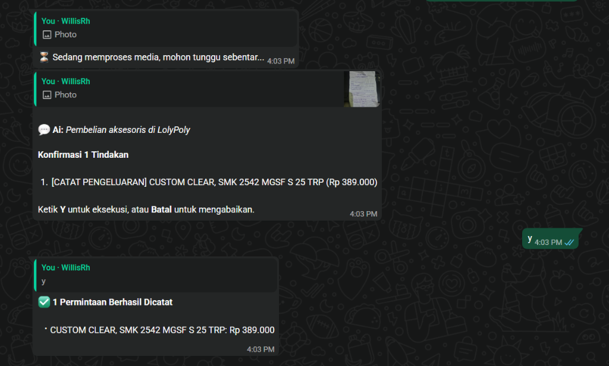

# 💰 Keuanganku - AI Expense Tracker

Keuanganku adalah aplikasi pencatat pengeluaran bertenaga AI yang dirancang untuk membantu Anda mengelola keuangan dengan lebih cerdas. Dilengkapi dengan asisten AI (Gemini) dan integrasi WhatsApp Bot untuk pencatatan transaksi yang instan dan mudah.

## 🖼️ Preview

### Dashboard Utama


### WhatsApp Bot Assistant


## 🚀 Fitur Utama

- **📝 Pencatatan Cepat**: Catat transaksi melalui antarmuka web yang modern atau langsung lewat WhatsApp.
- **🤖 Asisten AI (Gemini)**: Analisis pengeluaran, tanya jawab seputar keuangan, dan pencatatan otomatis berbasis teks/kalimat natural.
- **🎯 Target Anggaran (Budgeting)**: Tetapkan batasan pengeluaran per kategori dan pantau progresnya secara visual.
- **🧾 Validasi Struk**: Fitur validasi struk belanja digital untuk memastikan keaslian transaksi.
- **📊 Visualisasi Data**: Grafik interaktif untuk memantau pemasukan dan pengeluaran Anda.
- **📱 Responsive Design**: Tampilan yang optimal baik di desktop maupun perangkat mobile.
- **🌙 Dark Mode**: Dukungan mode gelap yang nyaman di mata.

## 🛠️ Teknologi yang Digunakan

- **Frontend**: Next.js, React, TypeScript, Tailwind CSS (Custom Styles).
- **Backend**: Next.js API Routes.
- **Database**: Prisma ORM (SQLite/PostgreSQL).
- **AI**: Google Gemini Pro API.
- **Integration**: `whatsapp-web.js` untuk WhatsApp Bot.

## ⚙️ Cara Instalasi

1. **Clone repositori**:
   ```bash
   git clone https://github.com/username/expense-tracker.git
   cd expense-tracker
   ```

2. **Instal dependensi**:
   ```bash
   npm install
   ```

3. **Konfigurasi Environment**:
   Buat file `.env` di root direktori dan isi dengan:
   ```env
   DATABASE_URL="file:./dev.db"
   GEMINI_API_KEY="your_gemini_api_key_here"
   ```

4. **Setup Database**:
   ```bash
   npx prisma generate
   npx prisma db push
   ```

5. **Jalankan Aplikasi**:
   ```bash
   npm run dev
   ```

6. **Jalankan WhatsApp Bot (Opsional)**:
   Buka terminal baru dan jalankan:
   ```bash
   # Pastikan Anda sudah mengonfigurasi nomor yang diizinkan di bot/index.ts
   npx ts-node bot/index.ts
   ```

## 📄 Lisensi

Proyek ini dibuat untuk tujuan pembelajaran. Silakan gunakan dan modifikasi sesuai kebutuhan.

---
*Dibuat dengan ❤️ serta **Vibe Code** dan menggunakan **Google Antigravity** untuk manajemen keuangan yang lebih baik.*
